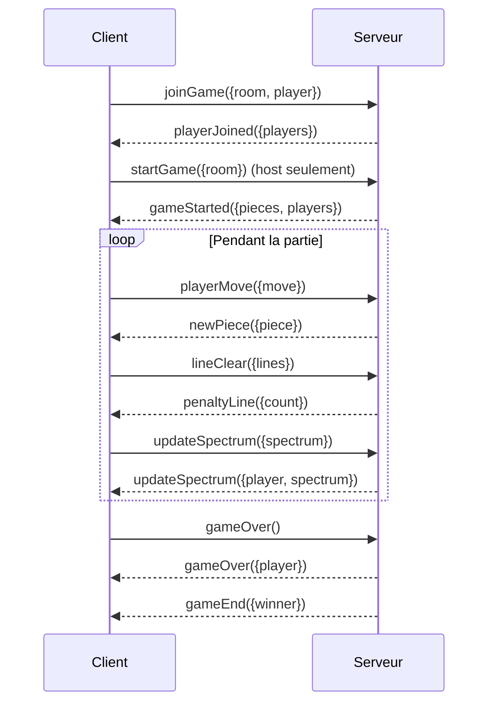

# 📌 Plan de travail Red Tetris

Projet : Développement d’un Tetris multijoueur en Full Stack JavaScript  
Durée : 4 semaines – 2 développeurs (Backend / Frontend)

---

## 🗓️ Semaine 1 – Mise en place & cadrage
### Backend
- Cloner le boilerplate `red_tetris_boilerplate`.
- Mise en place du serveur Node.js avec Express + Socket.io.
- Définir les classes de base :
  - `Player` (id, nom, état).
  - `Game` (joueurs, état de la partie, séquence des pièces).
  - `Piece` (forme, position).
- Créer les premiers événements socket.io :
  - `playerJoined`, `playerLeft`.
  - `startGame`.

### Frontend
- Créer une SPA en React (ou Vue).
- Mettre en place Redux pour la gestion d’état.
- Créer la structure visuelle de base :
  - Composant `GameBoard`.
  - Composant `SpectrumBoard`.
- Gestion de la route : `http://<server>/<room>/<player>`.
- Connexion au serveur via socket.io (affichage console “connected”).

✅ **Objectif fin semaine 1** : un joueur peut rejoindre une partie et voir la liste des joueurs connectés.

---

## 🗓️ Semaine 2 – Logique du jeu
### Backend
- Implémenter la logique Tetris côté serveur :
  - Génération de la séquence de pièces identique pour tous les joueurs.
  - Distribution synchrone des pièces (`newPiece`).
  - Gestion du "host" (seul le host peut lancer la partie).
- Ajouter l’event `updateSpectrum`.

### Frontend
- Implémenter la logique locale :
  - Déplacement gauche/droite.
  - Rotation.
  - Soft drop & hard drop.
- Rendu graphique du plateau 10x20 en CSS Grid.
- Réception des pièces du serveur et affichage.
- Envoi de l’état du spectre au serveur après chaque mouvement.

✅ **Objectif fin semaine 2** : pièces jouables et séquence partagée entre tous les joueurs.

---

## 🗓️ Semaine 3 – Interaction multijoueur
### Backend
- Implémenter la gestion des lignes envoyées :
  - Quand un joueur clear une ligne → envoyer `penaltyLine` aux adversaires.
- Gérer la fin de partie (dernier joueur vivant = vainqueur).
- Support multi-room (plusieurs parties en parallèle).

### Frontend
- Afficher le spectre des adversaires en temps réel.
- Implémenter la réception des `penaltyLines`.
- Ajouter un lobby (choix pseudo + salle).
- Écran "Game Over" + retour au lobby.

✅ **Objectif fin semaine 3** : partie multijoueur fonctionnelle avec interactions.

---

## 🗓️ Semaine 4 – Finalisation & tests
### Backend
- Tests unitaires (≥70% coverage).
- Vérifier gestion des déconnexions.
- Optimiser la boucle serveur.

### Frontend
- Tests unitaires sur reducers Redux et composants.
- Améliorer l’UI (score, vainqueur, rendu visuel).
- Corriger les bugs.
- Écran de victoire.

✅ **Objectif fin semaine 4** : jeu jouable, stable, testé et prêt pour soutenance.

---

# 🔌 Protocole Socket.io

## 📥 Client → Serveur
- **`joinGame`**
  - `{ room: string, player: string }`
  - Le joueur rejoint une partie.
- **`startGame`**
  - `{ room: string }`
  - Le host lance la partie.
- **`playerMove`**
  - `{ room: string, move: "left"|"right"|"rotate"|"softDrop"|"hardDrop" }`
  - Action du joueur.
- **`lineClear`**
  - `{ room: string, lines: number }`
  - Signale un clear de ligne(s).
- **`updateSpectrum`**
  - `{ room: string, spectrum: number[] }`
  - Envoie le spectre du joueur.
- **`gameOver`**
  - `{ room: string }`
  - Notifie que le joueur est éliminé.

---

## 📤 Serveur → Client
- **`playerJoined`**
  - `{ players: string[] }`
  - Liste des joueurs connectés.
- **`playerLeft`**
  - `{ player: string }`
  - Retire un joueur.
- **`gameStarted`**
  - `{ pieces: Piece[], players: string[] }`
  - Séquence initiale envoyée.
- **`newPiece`**
  - `{ piece: Piece }`
  - Nouvelle pièce distribuée.
- **`updateSpectrum`**
  - `{ player: string, spectrum: number[] }`
  - Mise à jour du spectre d’un joueur.
- **`penaltyLine`**
  - `{ count: number }`
  - Ajout de lignes indestructibles.
- **`gameOver`**
  - `{ player: string }`
  - Annonce qu’un joueur a perdu.
- **`gameEnd`**
  - `{ winner: string }`
  - Annonce le vainqueur.

---

# 🔁 Exemple de flux
1. Client → `joinGame({room:"A", player:"Kenny"})`  
2. Serveur → `playerJoined({players:["Kenny"]})`  
3. Client (host) → `startGame({room:"A"})`  
4. Serveur → `gameStarted({pieces:[…], players:[…]})`  
5. Pendant la partie :
   - Client → `playerMove({move:"left"})`
   - Serveur → `newPiece({piece:…})`
   - Client → `lineClear({lines:2})`
   - Serveur → `penaltyLine({count:1})`
   - Client → `updateSpectrum({spectrum:[…]})`
   - Serveur → `updateSpectrum({player:"Kenny", spectrum:[…]})`
6. Fin de partie :
   - Client → `gameOver()`
   - Serveur → `gameOver({player:"Kenny"})`
   - Serveur → `gameEnd({winner:"Alice"})`

# 🔁 Diagramme de séquence (Mermaid)

